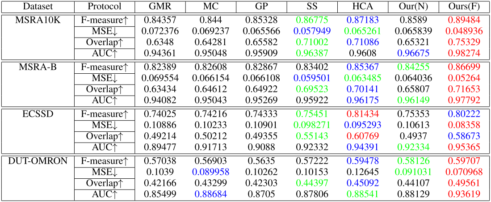
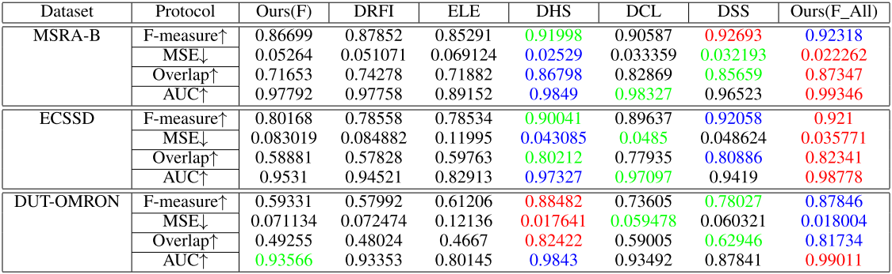

# [Super Diffusion for Salient Object Detection(TIP2019)](https://arxiv.org/pdf/1811.09038.pdf)

[Peng Jiang](https://github.com/sdujump), [Zhiyi Pan](https://github.com/panzhiyi), Changhe Tu, Nuno Vasconcelos, Baoquan Chen, and Jingliang Peng

## Introduction

In this work, we firstly present a novel view of the working mechanism of the diffusion process based on mathematical analysis, which reveals that the diffusion process is actually computing the similarity of nodes with respect to the seeds based on diffusion maps. Following this analysis, we propose super diffusion, a novel inclusive learning-based framework for salient object detection, which makes the optimum and robust performance by integrating a large pool of feature spaces, scales and even features originally computed for non-diffusion-based salient object detection. 

## Performance Statistics of Unsupervised/Supervised  Algorithms

For each dataset and protocol, the top three results are highlighted in red, blue and green, respectively. The   ↑/↓ sign indicates that the value is positively/negatively related with the performance. 

<center>Tabel 1. performance statistics of unsupervised algorithms</center>



<center>Tabel 2. performance statistics of supervised algorithms</center>



## Usage

1. Preparation:

   * Clone the repository. This code is tested on the MATLAB R2017a.

   * Run the make.m in [EntropyRateSuperpixel](https://github.com/mingyuliutw/EntropyRateSuperpixel) and put the `mex_ers`  in root folder.

   * ```matlab
     addpath('./others/')
     ```

2. Dataset

   Download the [MSRA10K](https://mmcheng.net/msra10k/) and change the `imgRoot` to your MSRA10K path in `SuperDiffusion.m`.

3. Evaluation

   * Change the `saldir` to your save folder in `SuperDiffusion.m`.

   * Put the `./weight.mat` in your save folder.

   * ```matlab
     run SuperDiffusion.m
     ```

4. Training

   * Change the `saldir` to your save folder in `SuperDiffsion.m`.

   * If you want to use saliency features computed by other methods as input, put features in `./otherfeature` and change the `args.otherfeature` in `SuperDiffusion.m`.

   * ```matlab
     run SuperDiffusion.m
     ```

## Citation

If SuperDiffusion is useful for your research, please consider citing:

```
@article{DBLP:journals/tip/JiangPTVCP20,
  author    = {Peng Jiang and
               Zhiyi Pan and
               Changhe Tu and
               Nuno Vasconcelos and
               Baoquan Chen and
               Jingliang Peng},
  title     = {Super Diffusion for Salient Object Detection},
  journal   = {{IEEE} Trans. Image Processing}
}
```
